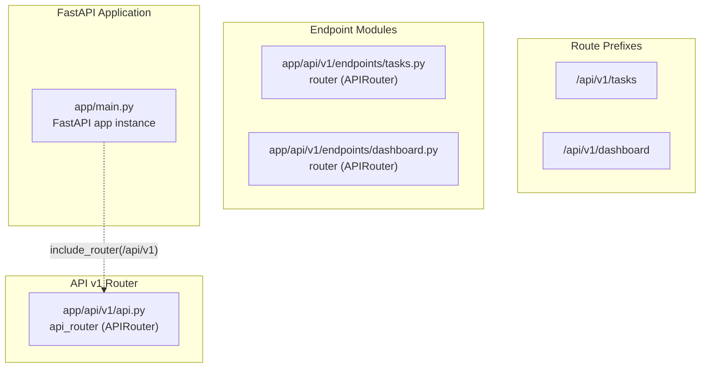
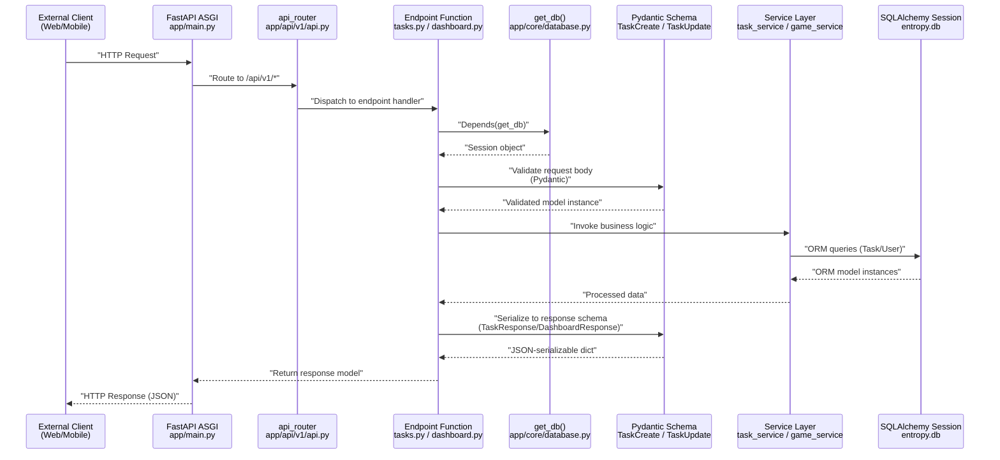
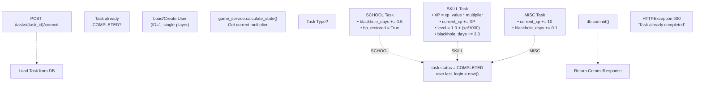

# API Layer

> **Relevant source files**
> * [app/api/v1/api.py](https://github.com/YC815/entropy_backend/blob/7b608553/app/api/v1/api.py)
> * [app/api/v1/endpoints/dashboard.py](https://github.com/YC815/entropy_backend/blob/7b608553/app/api/v1/endpoints/dashboard.py)
> * [app/api/v1/endpoints/tasks.py](https://github.com/YC815/entropy_backend/blob/7b608553/app/api/v1/endpoints/tasks.py)
> * [app/schemas/dashboard.py](https://github.com/YC815/entropy_backend/blob/7b608553/app/schemas/dashboard.py)

## Purpose and Scope

The API Layer serves as the HTTP interface for the EntroPy Backend system, exposing RESTful endpoints that external clients (web frontend, mobile apps) use to interact with the application. This layer handles request routing, input validation via Pydantic schemas, and delegates business logic to the Service Layer ([see page 6](/YC815/entropy_backend/6-service-layer)). It is built on FastAPI's ASGI framework with dependency injection for database sessions.

For database schema and ORM models used by these endpoints, see [Database & Persistence](/YC815/entropy_backend/4-database-and-persistence). For the business logic invoked by these endpoints, see [Service Layer](/YC815/entropy_backend/6-service-layer).

**Sources:** [app/api/v1/endpoints/tasks.py L1-L224](https://github.com/YC815/entropy_backend/blob/7b608553/app/api/v1/endpoints/tasks.py#L1-L224)

 [app/api/v1/api.py L1-L13](https://github.com/YC815/entropy_backend/blob/7b608553/app/api/v1/api.py#L1-L13)

---

## Architecture Overview

The API Layer implements a hierarchical routing structure under the `/api/v1` prefix, with version-based URL organization for future API evolution. All endpoints follow RESTful conventions with appropriate HTTP methods and status codes.

### API Router Hierarchy



**Sources:** [app/api/v1/api.py L1-L13](https://github.com/YC815/entropy_backend/blob/7b608553/app/api/v1/api.py#L1-L13)

The routing structure is organized as follows:

| Module | Router Variable | Prefix | Tags | Description |
| --- | --- | --- | --- | --- |
| `app/api/v1/api.py` | `api_router` | `/api/v1` | - | Top-level aggregator for all v1 endpoints |
| `app/api/v1/endpoints/tasks.py` | `router` | `/tasks` | `["tasks"]` | Task CRUD, speech-to-task, and commit operations |
| `app/api/v1/endpoints/dashboard.py` | `router` | `/dashboard` | `["dashboard"]` | Strategic overview and game state retrieval |

**Sources:** [app/api/v1/api.py L6-L11](https://github.com/YC815/entropy_backend/blob/7b608553/app/api/v1/api.py#L6-L11)

---

## Endpoint Catalog

### Task Endpoints

The tasks router provides seven endpoints for task lifecycle management:

| HTTP Method | Route | Function Name | Status Code | Response Model | Description |
| --- | --- | --- | --- | --- | --- |
| GET | `/api/v1/tasks/` | `read_tasks` | 200 | `List[TaskResponse]` | Retrieve paginated task list |
| POST | `/api/v1/tasks/` | `create_task` | 201 | `TaskResponse` | Create a single task manually |
| GET | `/api/v1/tasks/{task_id}` | `read_task` | 200 | `TaskResponse` | Retrieve a specific task by ID |
| PATCH | `/api/v1/tasks/{task_id}` | `update_task` | 200 | `TaskResponse` | Partially update task fields |
| DELETE | `/api/v1/tasks/{task_id}` | `delete_task` | 204 | None | Delete a task permanently |
| POST | `/api/v1/tasks/speech` | `create_tasks_from_speech` | 201 | `List[TaskResponse]` | Create tasks from audio via AI |
| POST | `/api/v1/tasks/{task_id}/commit` | `commit_task` | 200 | `CommitResponse` | Complete task and calculate rewards |

**Sources:** [app/api/v1/endpoints/tasks.py L22-L223](https://github.com/YC815/entropy_backend/blob/7b608553/app/api/v1/endpoints/tasks.py#L22-L223)

### Dashboard Endpoint

The dashboard router provides a single endpoint for game state retrieval:

| HTTP Method | Route | Function Name | Status Code | Response Model | Description |
| --- | --- | --- | --- | --- | --- |
| GET | `/api/v1/dashboard/` | `get_dashboard_status` | 200 | `DashboardResponse` | Retrieve current user stats, HP, stress breakdown |

**Sources:** [app/api/v1/endpoints/dashboard.py L11-L17](https://github.com/YC815/entropy_backend/blob/7b608553/app/api/v1/endpoints/dashboard.py#L11-L17)

---

## Request Flow Architecture

### Request Processing Pipeline



**Sources:** [app/api/v1/endpoints/tasks.py L1-L224](https://github.com/YC815/entropy_backend/blob/7b608553/app/api/v1/endpoints/tasks.py#L1-L224)

 [app/api/v1/endpoints/dashboard.py L1-L17](https://github.com/YC815/entropy_backend/blob/7b608553/app/api/v1/endpoints/dashboard.py#L1-L17)

### Dependency Injection Pattern

All endpoint functions use FastAPI's dependency injection system for database session management:

```yaml
db: Session = Depends(get_db)
```

The `get_db()` dependency is defined in [app/core/database.py](https://github.com/YC815/entropy_backend/blob/7b608553/app/core/database.py)

 and yields a SQLAlchemy `Session` object that is automatically closed after the request completes. This ensures proper connection pooling and transaction management.

**Sources:** [app/api/v1/endpoints/tasks.py L8](https://github.com/YC815/entropy_backend/blob/7b608553/app/api/v1/endpoints/tasks.py#L8-L8)

 [app/api/v1/endpoints/tasks.py L26](https://github.com/YC815/entropy_backend/blob/7b608553/app/api/v1/endpoints/tasks.py#L26-L26)

 [app/api/v1/endpoints/dashboard.py L4](https://github.com/YC815/entropy_backend/blob/7b608553/app/api/v1/endpoints/dashboard.py#L4-L4)

---

## Endpoint Implementation Details

### CRUD Operations

The basic CRUD endpoints follow RESTful conventions with appropriate HTTP status codes:

* **GET /tasks/**: Supports pagination via `skip` and `limit` query parameters (defaults: 0, 100)
* **POST /tasks/**: Returns `201 Created` on success
* **GET /tasks/{task_id}**: Returns `404 Not Found` if task doesn't exist
* **PATCH /tasks/{task_id}**: Uses `model_dump(exclude_unset=True)` for partial updates
* **DELETE /tasks/{task_id}**: Returns `204 No Content` on successful deletion

**Sources:** [app/api/v1/endpoints/tasks.py L22-L111](https://github.com/YC815/entropy_backend/blob/7b608553/app/api/v1/endpoints/tasks.py#L22-L111)

## Special Endpoints

### Speech-to-Task Endpoint

The `/tasks/speech` endpoint is a POST endpoint that accepts audio files and uses the AI Service to convert speech to structured tasks:

**Request:**

* HTTP Method: POST
* Content-Type: `multipart/form-data`
* Body: `file` (UploadFile) - Audio file in format supported by Google Gemini

**Response:**

* Status Code: 201
* Body: `List[TaskResponse]` - Multiple tasks can be created from a single audio instruction

**Implementation Flow:**

1. Accepts `UploadFile` via FastAPI's `File(...)` dependency
2. Calls `ai_service.process_audio_instruction(file)` to get `List[TaskCreate]`
3. Iterates over parsed tasks and calls `task_service.create_new_task(db, task_in)` for each
4. Returns all created tasks as `List[TaskResponse]`

**Sources:** [app/api/v1/endpoints/tasks.py L117-L134](https://github.com/YC815/entropy_backend/blob/7b608553/app/api/v1/endpoints/tasks.py#L117-L134)

### Task Commit Endpoint

The `/tasks/{task_id}/commit` endpoint implements the "结算仪式" (Settlement Ritual) that calculates rewards when a task is completed:

**Request:**

* HTTP Method: POST
* Path Parameter: `task_id` (int)

**Response:**

* Status Code: 200
* Body: `CommitResponse` with fields: * `task_id`: int * `status`: str * `xp_gained`: int * `hp_restored`: bool * `message`: str

**Implementation Logic:**



**Sources:** [app/api/v1/endpoints/tasks.py L145-L223](https://github.com/YC815/entropy_backend/blob/7b608553/app/api/v1/endpoints/tasks.py#L145-L223)

The commit endpoint directly implements reward calculations rather than delegating to a service layer, as it combines game state retrieval (`game_service.calculate_state`) with direct database mutations. This design decision centralizes the "settlement moment" logic in the API layer.

---

## Error Handling

The API layer uses FastAPI's `HTTPException` to return appropriate HTTP status codes:

| Status Code | Usage | Example Locations |
| --- | --- | --- |
| 400 Bad Request | Business rule violations | Task already completed |
| 404 Not Found | Resource not found | Task ID doesn't exist |
| 201 Created | Successful resource creation | POST /tasks/, POST /tasks/speech |
| 204 No Content | Successful deletion | DELETE /tasks/{task_id} |

**Sources:** [app/api/v1/endpoints/tasks.py L53](https://github.com/YC815/entropy_backend/blob/7b608553/app/api/v1/endpoints/tasks.py#L53-L53)

 [app/api/v1/endpoints/tasks.py L107](https://github.com/YC815/entropy_backend/blob/7b608553/app/api/v1/endpoints/tasks.py#L107-L107)

 [app/api/v1/endpoints/tasks.py L161](https://github.com/YC815/entropy_backend/blob/7b608553/app/api/v1/endpoints/tasks.py#L161-L161)

All error responses follow FastAPI's default error format:

```json
{
  "detail": "Error message string"
}
```

---

## Schema Validation

### Request Schemas

The API layer uses Pydantic schemas for request validation (defined in [app/schemas/task.py](https://github.com/YC815/entropy_backend/blob/7b608553/app/schemas/task.py)

):

* **TaskCreate**: Used for POST /tasks/ (required fields: title, type, difficulty)
* **TaskUpdate**: Used for PATCH /tasks/{task_id} (all fields optional for partial updates)

Validation occurs automatically before the endpoint function executes. Invalid requests return `422 Unprocessable Entity` with detailed validation errors.

**Sources:** [app/api/v1/endpoints/tasks.py L11](https://github.com/YC815/entropy_backend/blob/7b608553/app/api/v1/endpoints/tasks.py#L11-L11)

 [app/api/v1/endpoints/tasks.py L38](https://github.com/YC815/entropy_backend/blob/7b608553/app/api/v1/endpoints/tasks.py#L38-L38)

 [app/api/v1/endpoints/tasks.py L65](https://github.com/YC815/entropy_backend/blob/7b608553/app/api/v1/endpoints/tasks.py#L65-L65)

### Response Schemas

Response serialization uses `response_model` parameter in FastAPI decorators:

* **TaskResponse**: Serializes Task ORM objects for all task endpoints
* **DashboardResponse**: Serializes game state with nested schemas (UserInfo, StressItem list)
* **CommitResponse**: Custom schema for task completion rewards

These schemas ensure only intended fields are exposed to clients and provide automatic documentation in OpenAPI/Swagger UI.

**Sources:** [app/api/v1/endpoints/tasks.py L22](https://github.com/YC815/entropy_backend/blob/7b608553/app/api/v1/endpoints/tasks.py#L22-L22)

 [app/api/v1/endpoints/tasks.py L34](https://github.com/YC815/entropy_backend/blob/7b608553/app/api/v1/endpoints/tasks.py#L34-L34)

 [app/api/v1/endpoints/dashboard.py L11](https://github.com/YC815/entropy_backend/blob/7b608553/app/api/v1/endpoints/dashboard.py#L11-L11)

 [app/schemas/dashboard.py L1-L24](https://github.com/YC815/entropy_backend/blob/7b608553/app/schemas/dashboard.py#L1-L24)

---

## API Versioning Strategy

The current API is organized under `/api/v1` prefix, as configured in [app/api/v1/api.py L6-L11](https://github.com/YC815/entropy_backend/blob/7b608553/app/api/v1/api.py#L6-L11)

 This structure allows for future API evolution:

* **v1**: Current stable API
* **v2**: Reserved for breaking changes (not yet implemented)

The `include_router` pattern makes it easy to maintain multiple API versions simultaneously by mounting different routers at different prefixes (e.g., `/api/v1` and `/api/v2`).

**Sources:** [app/api/v1/api.py L1-L13](https://github.com/YC815/entropy_backend/blob/7b608553/app/api/v1/api.py#L1-L13)

---

## Summary

The API Layer implements a clean separation between HTTP protocol concerns and business logic. Key characteristics:

* **RESTful Design**: Standard HTTP methods, appropriate status codes, resource-oriented URLs
* **Type Safety**: Pydantic schemas for validation and serialization
* **Dependency Injection**: Database sessions managed via FastAPI dependencies
* **Layered Architecture**: Endpoints delegate to Service Layer for business logic
* **Special Endpoints**: AI-powered speech-to-task and gamification reward calculations
* **Version Control**: URL-based versioning under `/api/v1` prefix

The API layer serves as the contract between external clients and the EntroPy Backend system, documented automatically via OpenAPI/Swagger UI at `/docs` endpoint.
